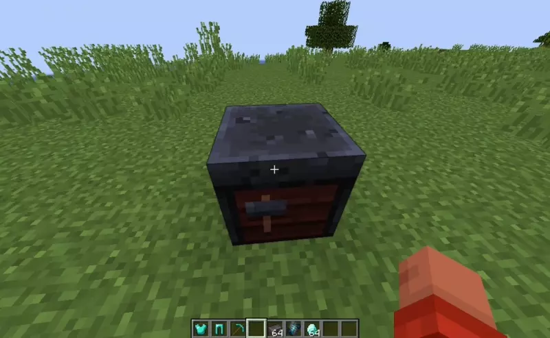

#  OldNetheriteSmithing

A simple plugin that allows to upgrade gear without smithing template

Permissions: `oldnethersmithing.smith`

Spigot: https://www.spigotmc.org/resources/oldnetheritesmithing.112594/  
Modrinth: https://modrinth.com/plugin/oldnetheritesmithing

Also you may try https://github.com/TrollsterCooleg/NoNetheriteTemplate this is more straightforward plugin that adds custom smithing table recipes, but this implementation does not compatible with permissions because register recipes globally. Use this plugin only if you need permissions, otherwise use the one that was provided earlier.
